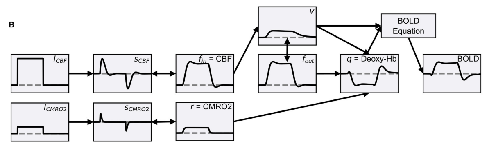

# BalloonModel

A Python library made in order to simulate BOLD signals using the Balloon Model 
proposed by Buxton 1998, but with modifications according to Stephan 2007

The pipeline is as follows (Taken from Maith 2022)
